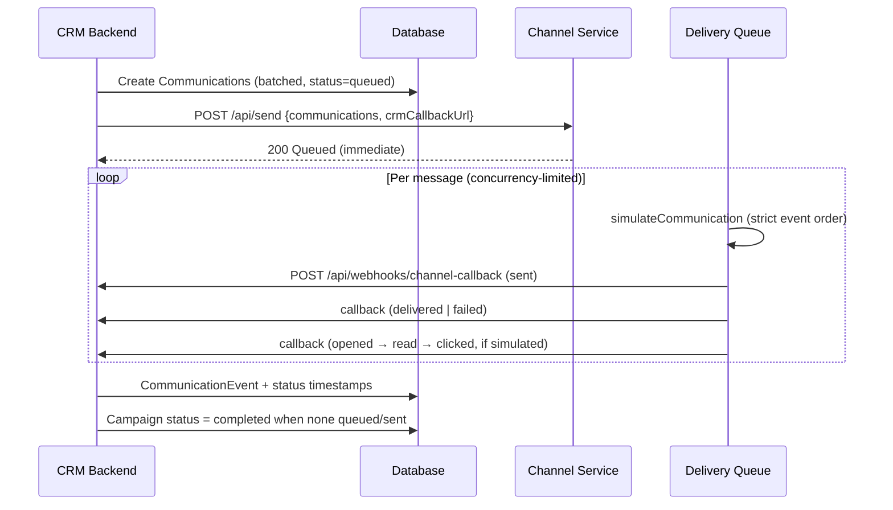

# Channel Service — Architecture

The channel service is a **separate process** that simulates WhatsApp, SMS, Email, and RCS delivery. It models how real messaging providers work: accept sends, simulate outcomes, and **call back asynchronously** into the CRM receipt API.

## Flow



## Design decisions

### 1. Separate service
CRM never fakes delivery. All outbound messages go through `channel-service` on port **3001**, matching the assignment’s two-service model.

### 2. Volume — batched CRM writes + concurrency queue
| Layer | Approach |
|-------|----------|
| **CRM** | `createMany` in batches of 100 (`COMMUNICATION_BATCH_SIZE`) |
| **Channel** | `ConcurrencyQueue` — default **12** parallel message simulations (`CHANNEL_CONCURRENCY`) |

CRM responds to the UI immediately; channel work runs in the background.

### 3. Ordering — strict per-message sequence
Events fire in order via `await` chain (not parallel `setTimeout`):

```
sent → delivered → opened → read → clicked
  └→ failed (alternative branch after sent)
```

Late or duplicate callbacks cannot downgrade status — CRM uses rank-based `buildCommunicationUpdates()`.

### 4. Retries — exponential backoff
`sendCallbackWithRetry()` attempts up to **4** POSTs with backoff (400ms → 800ms → 1600ms → cap 8s).

CRM webhook dedupes events:

```prisma
@@unique([communicationId, eventType])
```

Retries are **idempotent** — safe to replay.

### 5. Failures
| Failure | Handling |
|---------|----------|
| **Delivery fails** | Channel simulates `sent → failed`; CRM stores event |
| **Callback HTTP fails** | Channel retries; after exhaustion → **dead-letter log** |
| **Channel service down** | CRM marks campaign `failed` (not silent revert) |
| **Invalid payload** | Channel returns `400` |

Inspect dead letters: `GET http://localhost:3001/api/dead-letter`

### 6. Health & observability
```bash
curl http://localhost:3001/api/health
# { ok, service, queue: { waiting, active, concurrency, deadLetterCount } }
```

## Environment variables

| Variable | Default | Description |
|----------|---------|-------------|
| `PORT` | `3001` | Channel service port |
| `CHANNEL_CONCURRENCY` | `12` | Max parallel message simulations |
| `CALLBACK_MAX_RETRIES` | `4` | CRM callback retry attempts |
| `CALLBACK_BASE_DELAY_MS` | `400` | Initial retry backoff |

CRM side:

| Variable | Description |
|----------|-------------|
| `CHANNEL_SERVICE_URL` | e.g. `http://localhost:3001` |
| `CRM_PUBLIC_URL` | Public CRM URL for callbacks (required in production) |

## File structure

```
channel-service/src/
├── server.ts      # HTTP API (/api/send, /api/health, /api/dead-letter)
├── delivery.ts    # Per-message simulation orchestration
├── simulator.ts   # Event sequence + channel rates
├── callback.ts    # Retry + dead-letter
├── queue.ts       # Concurrency-limited worker pool
└── types.ts
```

## Test locally

```bash
# Terminal 1: backend
cd backend && npm run dev

# Terminal 2: channel service
cd channel-service && npm run dev

# Send a draft campaign
curl -X POST http://localhost:3000/api/campaigns/<ID>/send

# Watch queue drain
curl http://localhost:3001/api/health

# Poll stats (counts tick up as callbacks arrive)
curl http://localhost:3000/api/campaigns/<ID>/stats
```

## Scale assumptions (for video / interview)

| At assignment scope | At production scale |
|---------------------|---------------------|
| In-memory queue + `setTimeout` | Redis/Bull or SQS job queue |
| In-memory dead-letter log | Persistent DLQ + alerts |
| SQLite / Postgres single node | Sharded comms table, read replicas |
| Synchronous segment match at send | Precomputed segment membership |

Example tradeoff line:

> *"I used an in-process concurrency queue for the take-home scope. At Xeno scale I'd move delivery simulation to a durable queue with at-least-once callbacks and idempotent receipt handling — which is why the CRM dedupes `(communicationId, eventType)`."*
